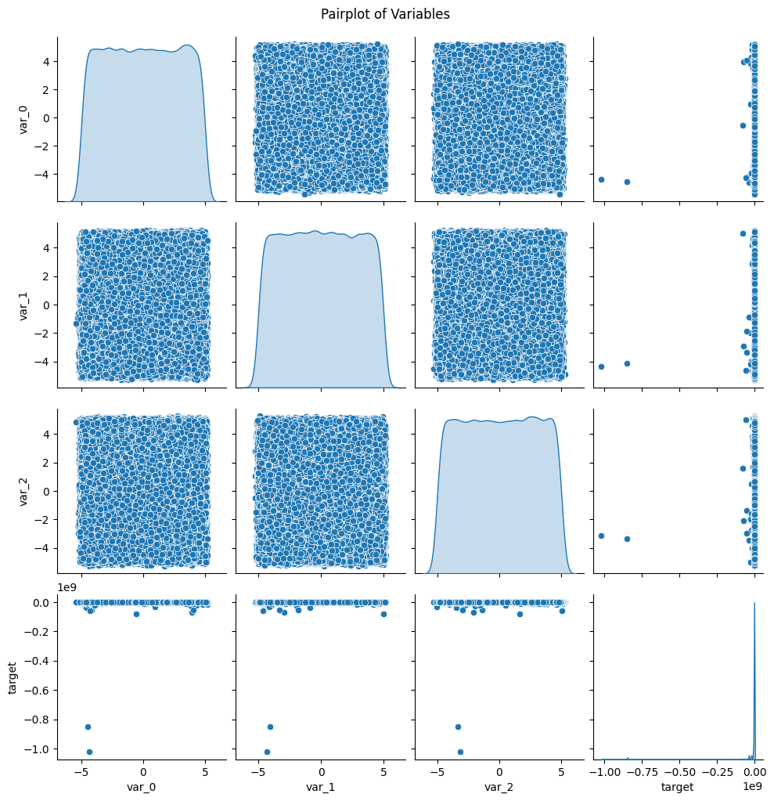
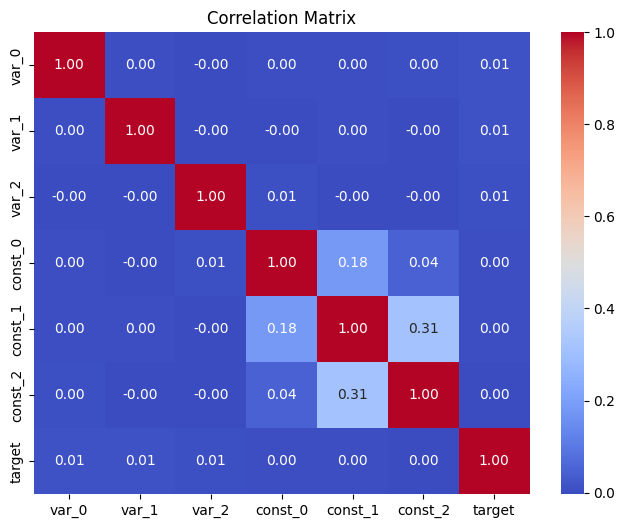
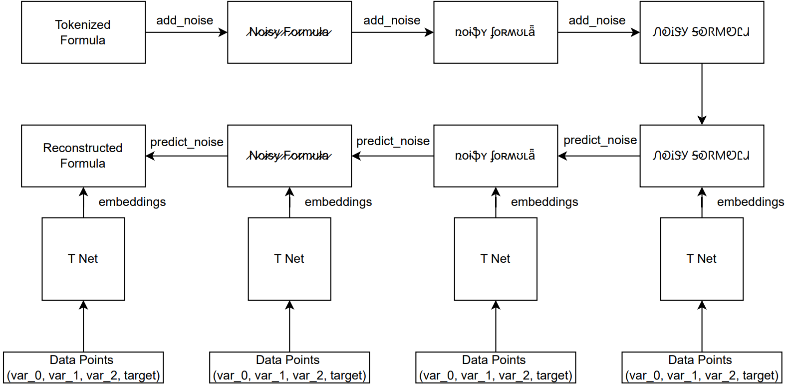
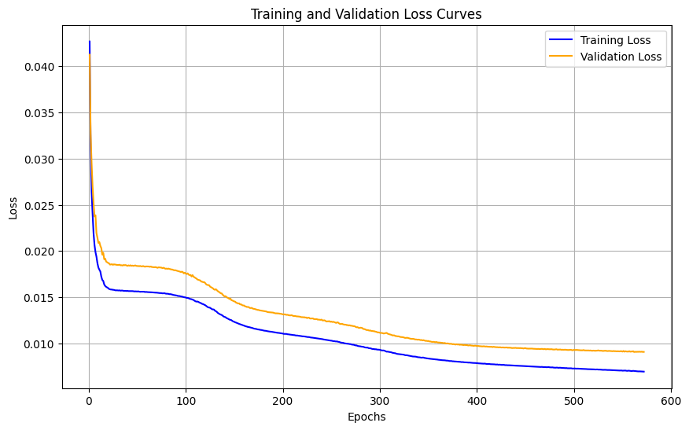

# Symbolic Regression with Diffusion Models  
_Exploring Novel Architectures for Formula Recovery Using Deep Generative Models_

This project introduces a diffusion-based framework for symbolic regression, a task traditionally dominated by genetic programming and transformer models. We explore three distinct modeling approaches, including a novel text diffusion model that shows superior performance on the SymbolicGPT dataset.

---

## Table of Contents

- [Project Overview](#-project-overview)  
- [Features](#-features)  
- [Tech Stack](#-tech-stack)  
- [Dataset Descriptions](#-dataset-descriptions)  
- [How It Works](#-how-it-works)
- [Results](#-results) 
- [Running the Code](#️-running-the-code)
- [Authors](#️-authors)  
- [License](#-license)

---

## Project Overview

Symbolic regression seeks to learn interpretable mathematical equations from data. Traditionally, methods like genetic programming (GP) or transformer-based approaches (SymbolicGPT) have been used to tackle this problem. This project, however, explores the novel application of diffusion models, known for their success in generative tasks like image or text synthesis, to symbolic regression.

We evaluate three approaches:
1. **Simple Diffusion Model Using Synthetic Data**: This approach uses a synthetic dataset consisting of 100 mathematical formulas, tokenized and passed through a simple diffusion model. The model progressively adds noise to formula embeddings, and the reverse diffusion process iteratively reconstructs the original equations. This approach primarily aims to assess the basic application of diffusion models to symbolic regression.
2. **Hybridized Tokenization with Self-Attention**: Building on the first approach, this method combines hierarchical parsing and regular expression-based tokenization. It integrates a multi-headed self-attention mechanism in the diffusion model, allowing it to focus on the relationships between tokens. This approach seeks to improve the accuracy of symbolic regression by incorporating more sophisticated tokenization and attention techniques.
3. **Text Diffusion Model Using an Existing Dataset**: This approach applies a text-based diffusion model for symbolic regression, leveraging a dataset from the SymbolicGPT paper. It works in a discrete token space where symbolic equations are tokenized and processed by a custom diffusion model inspired by Text Diffusion Models like DiffusionLM. This approach emphasizes adapting diffusion models for symbolic regression, focusing on discrete data and token-level operations.

We benchmark these approaches on both a synthetic dataset and a subset of the SymbolicGPT benchmark, comparing them using metrics like BLEU score, token similarity, and Levenshtein edit distance.

---

## Features

### Symbolic Regression via Diffusion
- Three modeling pipelines for symbolic formula reconstruction
- Forward and reverse diffusion applied to mathematical token embeddings
- Discrete + continuous noise modeling

### Approach-Specific Architectures
- Embedding-based, self-attention, and T-Net conditioned models
- Hybrid tokenization strategies (regex + parse trees)
- Discrete diffusion adapted for symbolic data

### Evaluation Metrics
- **BLEU Score**: Measures how closely the generated formula matches the ground truth formula in terms of n-grams, a common metric for sequence-to-sequence tasks.
- **Token Similarity**: Compares the embeddings of the generated tokens to those of the ground truth to assess how well the model captures token relationships.
- **Levenshtein Edit Distance**: A metric of structural similarity that measures the number of single-character edits needed to transform one string (formula) into another.

---

## Tech Stack

| Tool / Library       | Purpose                                |
|----------------------|----------------------------------------|
| `Python`, `PyTorch`  | Core modeling and training             |
| `NumPy`, `Pandas`    | Data manipulation                      |
| `Matplotlib`         | Visualization                          |
| `scikit-learn`       | Evaluation metrics (MSE, etc.)         |
| `gplearn`            | Genetic Programming baseline           |
| `Transformers`       | SymbolicGPT simulation                 |
| `Google Colab`       | Training environment with GPU          |

---

## Dataset Descriptions

| Dataset               | Description                                                             |
|-----------------------|-------------------------------------------------------------------------|
| **Synthetic Dataset** | 100 scientific-style formulas × 100 input-output pairs (up to 5 vars)   |
| **SymbolicGPT Subset**| 747 train / 160 val / 161 test formulas (3-variable setting)            |

### Synthetic Dataset
The Synthetic Dataset was created to facilitate the testing of symbolic regression approaches. It consists of 100 mathematical functions with varying levels of complexity. The functions include:

- Randomly generated equations with common mathematical operations, such as addition, multiplication, exponentiation, and trigonometric functions.
- Physics-inspired equations involving scientific constants, simulating real-world relationships.

Some of the randomly generated equations were partially inspired by the Nguyen benchmark equations, a widely-known benchmark in symbolic regression. The dataset was designed to include between 1 to 5 input variables and a univariate output. Each formula captures the relationship between a set of 100 input-output pairs, with each formula represented as a JSON object containing:

- 100 sampled (x₀, x₁, x₂, ...) → y tuples
- The ground truth formula in symbolic string form
- Metadata (e.g., operator depth, constants used)

This dataset provides a controlled environment for testing symbolic regression techniques.

### SymbolicGPT Subset
The SymbolicGPT Subset comes from the dataset used by Valipour et al. and consists of 747 training, 160 validation, and 161 test formulas. Each formula in this dataset has:

- 3 variables, ranging from -5.0 to +5.0
- 0 to 3 constants
- 100 samples corresponding to each formula, with input values and the resulting output (y)

The dataset is organized into three folders:
- Train folder: 747 JSON files, each representing a formula with 100 examples
- Validation folder: 160 JSON files for validation during model training
- Test folder: 161 JSON files for evaluation

The JSON files contain:
- A points key with the sampled (x₀, x₁, x₂) → y values
- A formula key with the human-readable symbolic formula
- A properties key with metadata such as operator depth, constants, and formula generation process information

**Note**: The dataset is *not included in this repository* due to potential proprietary content. It would need to be accessed separately from the source to obtain access.

#### Exploratory Data Analysis

An initial Exploratory Data Analysis (EDA) was conducted to assess data integrity and understand variable relationships:

<div style="display: flex; justify-content: space-between;">
  
  
</div>

- **Data Integrity**: No missing values were found in the dataset.
- **Visualizations**: 
  - The pair-plot shows that the variables have a uniform distribution within the bounds of -5.0 to +5.0. No significant correlations between variables or with the target were observed.
  - The correlation matrix confirms that the variables are uncorrelated with each other and the target.
- **Insights**: The lack of correlations suggests that symbolic regression is a suitable approach to model the relationships.

---

## How It Works

### Architectures

#### Approach 1: Diffusion + Synthetic Data
- Regex tokenization → Word2Vec embeddings  
- Cosine noise schedule for forward process  
- No conditioning on input datapoints  
- Loss: Mean Squared Error (MSE)

#### Approach 2: Self-Attention Enhanced Diffusion
- Hybrid tokenization (regex + parse tree)  
- Positional embeddings → Multi-head self-attention  
- Linear noise schedule  
- Loss: MSE over embeddings

#### Approach 3: Text Diffusion (Discrete Tokens)


- Vocabulary-based token → integer mapping  
- T-Net module encodes input datapoints  
- Discrete denoising with cross-entropy loss  
- Inspired by DiffusionLM (Li et al., 2022)

### Training Pipelines

| Aspect                | Approach 1                         | Approach 2                             | Approach 3                             |
|------------------------|------------------------------------|----------------------------------------|----------------------------------------|
| Dataset               | Synthetic only                    | SymbolicGPT subset                     | SymbolicGPT subset                     |
| Embedding             | Word2Vec                          | Learnable PyTorch embeddings           | Discrete tokens + T-Net conditioning   |
| Noise Scheduler       | Cosine                            | Linear                                 | Linear                                 |
| Conditioning          | None                              | Self-attention (intra-token)           | T-Net (cross-input attention)          |
| Loss Function         | Mean Squared Error (MSE)          | MSE                                    | Cross-entropy                          |
| Early Stopping        | Yes (val loss)                    | Yes                                    | Yes (patience = 10)                    |
| Epochs (max)          | 100 (stopped at 27)               | ~50                                    | 572                                    |

---

## 🧪 Results

### 📋 Evaluation Metrics

| Metric                  | Approach 3 | Approach 2 | Approach 1 |
|-------------------------|------------|------------|------------|
| **BLEU Score**          | 0.25       | 0.011      | 0.023      |
| **Token Similarity**    | 0.61       | –          | 0.030      |
| **Edit Distance**       | 7.22       | 19.09      | 12.42      |

> Approach 3 (Text Diffusion) shows superior performance across all symbolic similarity metrics.

### Text Diffusion Loss



### Key Findings

- Diffusion models can be successfully adapted to symbolic regression with proper formulation.
- Approach 3 shows that discrete denoising in token space is promising for mathematical reasoning tasks. It outperforms other methods, leveraging the ability of token-level operations to recover mathematical structure.
- While constants are not optimized in this study, the structure of formulas can still be effectively recovered, making this framework suitable for symbolic discovery tasks.
- This framework serves as a launchpad for further research into hybrid generative-symbolic modeling, opening the door for combining the power of generative models with interpretable mathematical reasoning.

---

## Running the Code

### Setup

Clone the repo and install dependencies:
```bash
pip install -r requirements.txt
```

### Project Structure

Setup the project accordingly:
```bash
STAT940_Project/
├── Approach1/                             # Basic diffusion approach
│   ├── Data/                              # Synthetic Data
│   └── approach1.ipynb                    # Basic diffusion model
│
├── Approach2/                             # Hybrid tokenization + self-attention approach
│   └── approach2.py                       # Hybrid tokenization + self-attention model
│
├── Approach3/                             # Discrete text diffusion approach
│   └── approach3.ipynb                    # Discrete text diffusion model
│
├── data_symbolic_regression/              # Existing dataset subset
│   ├── test/                              # test data
│   ├── train/                             # train data
│   └── val/                               # val data
│
├── preprocessed_df_symbolic_regression/   # Preprocessed Existing dataset subset
│   ├── test/                              # test data
│   ├── train/                             # train data
│   └── val/                               # val data
│
├── final_diffusion_model.ipynb            # Best performing approach
├── best_model.pth                         # Best performing model
└── requirements.txt                       # required framework and dependencies
```

### Example Execution

Run the best model:
```bash
jupyter notebook final_diffusion_model.ipynb
```

Or test any specific approach:
```bash
jupyter notebook Approach1/approach1.ipynb
```

---

## Authors

**Matthew Badal-Badalian**  
*MDSAI Graduate, University of Waterloo*  
- [LinkedIn](https://www.linkedin.com/in/badal/)    
- [GitHub](https://github.com/mbadalbadalian)

**Argho Das**  
*MDSAI Graduate, University of Waterloo*  
- [LinkedIn](https://www.linkedin.com/in/argho-das-7a9b12130/)    
- [GitHub](https://github.com/Argho2016)

**Pooja Krishan**  
*MDSAI Student, University of Waterloo*  
- [LinkedIn](https://www.linkedin.com/in/pooja-krishan/)    
- [GitHub](https://github.com/pooja-krishan/)

**Chris Verghese**  
*MDSAI Graduate, University of Waterloo*  
- [LinkedIn](https://www.linkedin.com/in/chris-verghese/)    
- [GitHub](https://github.com/cverghes/)

---

## License
This project is licensed under the [MIT License](LICENSE).

Portions of the dataset and baseline implementations adapted from:
- [SymbolicGPT (Valipour et al., 2021)](https://arxiv.org/abs/2106.14131)  
- [DiffusionLM (Li et al., 2022)](https://arxiv.org/abs/2205.14217)

You can find the full license text in the [`LICENSE`](./LICENSE.txt) file included in this repository.

MIT License © 2025 Matthew Badal-Badalian, Chris Verghese, Argho Das, Pooja Krishan
